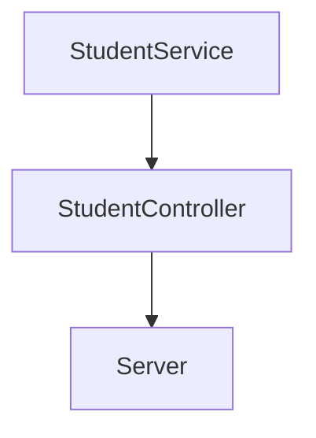
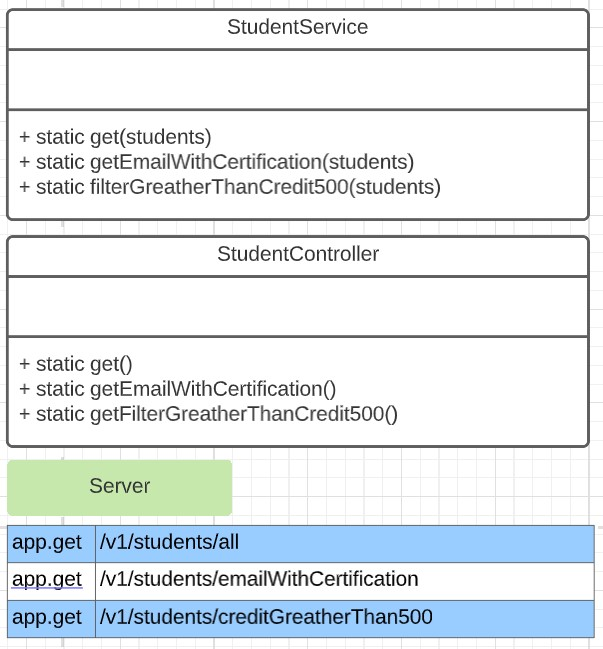

# Practica CodeChallenge 

## Instalaciones al crear este proyecto
1.- Ejecutamos `npm init -y`

2.- Ejecutamos `npm install --save-dev jest`

3.- Agregamos los siguientes script al package.json
```
"scripts": {
    "test": "node ./node_modules/jest/bin/jest.js",
    "linter": "node ./node_modules/eslint/bin/eslint.js .",
    "linter-fix": "node ./node_modules/eslint/bin/eslint.js . --fix",
    "server": "node ./lib/server.js"
  },
```

4.- Para ejecutar las pruebas tecleamos el siguiente comando `npm test`

Requerimientos:
1. Habilitar un endpoint para consultar todos los estudiantes con todos sus campos.
2. Habilitar un endpoint para consultar los emails de todos los estudiantes que tengan certificación `haveCertification`.
3. Habilitar un endpoint para consultar todos los estudiantes que tengan `credits` mayor a 500.

## Flujo de la funcionalidad


## Nivel detallado de servicio, controlador y server



### Pasos de codificacion
1. Creo la clase Reader junto con el metodo para leer un archivo json.

2. Creo el test llamado Reader.test.js con el test para leer un archivo json.

1. Creo el servicio StudentService.js junto con los metodos correspondientes.

2. Creo el test llamado StudentService.test.js con los test para cada uno de los metodos del servicio.

1. Creo el contralador StudentController.js junto con los metodos correspondientes.

2. Creo el test llamado StudentController.test.js con los test para cada uno de los metodos del controlador.


## **Conclusiones. Apuntes propios**

1. Por cada metodo dentro del archivo del **controlador** tiene su propio metodo dentro del archivo de **service**.
**Ojo**. Y dentro del metodo de service no accede a datos del modelo, si no que cuando se manda a llamar el metodo del controlador se sacan los datos primero del modelo y esos datos se pasan al service para que el servicio haga su trabajo correspondiente.

1. Por cada metodo de **endpoint** dentro del archivo de server tiene su propio metodo dentro del archivo de **controlador**.

1. Las responsabilidades dentro del **endpoint** solo es sacar los datos que recibimos de la fuente externa(Navegador) de quien lo invoca para que se invoque internamente el controlador y esa respuesta se la mandemos a quien invoco el endpoint.

1. Las responsabilidades dentro del **controlador** son:
    - Sacar los datos del modelo
    - Procesar esos datos y devolver el resultado a traves de un metodo el archivo de service
    - retornar el resultado esperado al endpoint

NOTA. 
- El **Servicio** no accede a datos del modelo, solo tiene la logica para que a partir de unos datos que se le pasan pueda hacer su trabajo.

- El **modelo** solo saca datos.

Realizacion a traves del curso NodeJs
[Code Challenge](https://github.com/LaunchX-InnovaccionVirtual/MissionNodeJS/blob/main/semanas/semana_4/5_code_challenge.md)