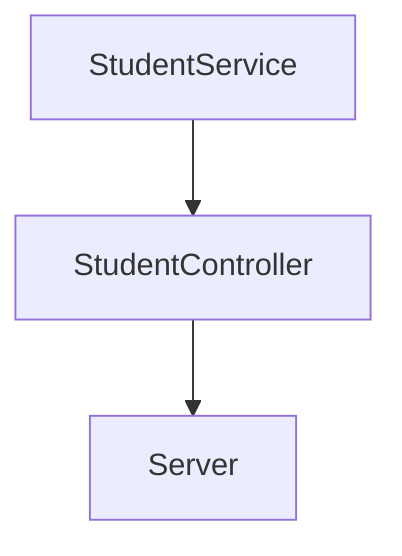

# Practica CodeChallenge 

## Instalaciones al crear este proyecto
1.- Ejecutamos `npm init -y`

2.- Ejecutamos `npm install --save-dev jest`

3.- Agregamos los siguientes script al package.json
```
"scripts": {
    "test": "node ./node_modules/jest/bin/jest.js",
    "linter": "node ./node_modules/eslint/bin/eslint.js .",
    "linter-fix": "node ./node_modules/eslint/bin/eslint.js . --fix",
    "server": "node ./lib/server.js"
  },
```
Requerimientos:
1. Habilitar un endpoint para consultar todos los estudiantes con todos sus campos.
2. Habilitar un endpoint para consultar los emails de todos los estudiantes que tengan certificación `haveCertification`.
3. Habilitar un endpoint para consultar todos los estudiantes que tengan `credits` mayor a 500.

## Flujo de la funcionalidad


## Nivel detallado de servicio, controlador y server

[Nivel detallado de clases](./imgMd/fileDetallado.jpg)

Realizacion a traves del curso NodeJs
[Code Challenge](https://github.com/LaunchX-InnovaccionVirtual/MissionNodeJS/blob/main/semanas/semana_4/5_code_challenge.md)